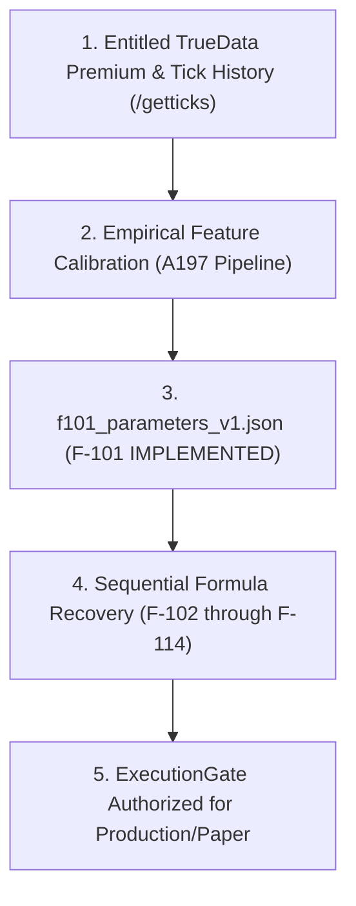

# A207: Adaptive Edge Listed Option Contract Display Policy (1 ATM + 2 ITM + 2 OTM)

**Status:** `[VERSIONED DISPLAY POLICY]`  
**Date:** 2026-08-15  
**Scope:** Adaptive Edge Operator Desk Presentation Layer  
**Supersedes / Implements:** None (`DISPLAY_POLICY_ONLY`)  
**Mathematical Status:** Formula F-109 (`Contract/Strike Selection Optimization`) remains `[LOCKED]`  

---

## 1. Executive Summary & Policy Statement

This artifact formalizes the **Adaptive Edge Listed Option Contract Display Policy** on the Sterling Kite research desk:

> **Policy Rule:** Following an intraday spot signal or direction evaluation, the Adaptive Edge desk maps the underlying price to a fixed 5-strike display ladder consisting of **1 ATM + 2 ITM + 2 OTM** listed option contracts (`ITM2`, `ITM1`, `ATM`, `OTM1`, `OTM2`).

```
          OTM2 (+2 Strikes / Out of the Money)
          OTM1 (+1 Strike / Out of the Money)
    --->  ATM  (At The Money / Nearest Strike)
          ITM1 (-1 Strike / In the Money)
          ITM2 (-2 Strikes / In the Money)
```

---

## 2. Explicit Non-Equivalence with Formula F-109

> [!IMPORTANT]
> **F-109 REMAINS LOCKED**: This display policy defines the visualization of liquid listed instruments for operator situational awareness. It is **NOT** a recovered mathematical specification for **Formula F-109** (*Contract/Strike Selection Optimization*).

| Attribute | A207 Display Policy (This Artifact) | Formula F-109 (Strategy Mathematics) |
| :--- | :--- | :--- |
| **Layer** | Frontend / Research API presentation | Causal quantitative selection engine |
| **Input** | Spot level + standard exchange strike step | Order flow acceleration, IV skew, bid-ask spread elasticity |
| **Output** | Fixed 5-contract candidate ladder (`ITM2..OTM2`) | Single optimal execution contract with slippage bound |
| **Execution Impact** | Non-executing display only (`ExecutionGate: FAIL-CLOSED`) | Authorizes live / paper routing when unlocked |
| **Registry Status** | Governance Display Layer | `LOCKED` (unimplemented) |

Under no circumstances should this display ladder be represented as a completed or recovered implementation of Formula F-109.

---

## 3. Governance Gap & Strict Unlock Pathway

Adaptive Edge is **not live**, **not calibrated**, and **not multi-index** in the AE quantitative sense. This gap is intentional by design and serves as a strict safety boundary:

1. **NIFTY Research Tape**: Uses causal research history and strict intraday session replays.
2. **Other Symbols (BANKNIFTY, FINNIFTY, SENSEX)**: Displayed with explicit `Spot Scan (ST direction)` badges when active, borrowing underlying scan direction while never fabricating AE causal features or sharing AE why-closed rationales.
3. **No SuperTrend Coupling**: Adaptive Edge maintains isolated risk, lifecycle, and protective stop mechanisms (`A126LifecycleEngine`, `ProtectionEngine`). SuperTrend trail lines and red-counter exits are never imported into AE.

### The Canonical Unlock Pathway

The path to strategy execution remains strictly gated:



---

## 4. Contract Display Specifications

For each scanned index, strikes are centered around the nearest rounded strike step:
- **NIFTY 50 (`NIFTY-I`)**: ₹50 step (`ATM = round(spot / 50) * 50`)
- **BANKNIFTY (`BANKNIFTY-I`)**: ₹100 step (`ATM = round(spot / 100) * 100`)
- **FINNIFTY (`FINNIFTY-I`)**: ₹50 step (`ATM = round(spot / 50) * 50`)
- **SENSEX (`SENSEX-I`)**: ₹100 step (`ATM = round(spot / 100) * 100`)

Call contracts (`CE`) are presented on `BUY` spot bias; Put contracts (`PE`) are presented on `SELL` spot bias.
Numeric entries, stops, trails, LTPs, and live differentials `(LTP - Entry)` must be computed and displayed in strict tabular form without obscuring provenance.
